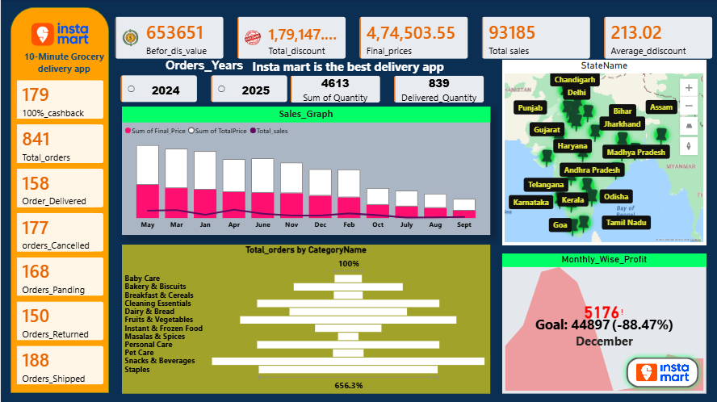

# Instamart
📌 Project Overview

This project analyzes Instamart grocery delivery data to uncover insights about customer orders, sales performance, delivery efficiency, and product demand. Instamart is a quick-commerce platform that delivers groceries and daily essentials within minutes, transforming how consumers shop online.

The dashboard was built using Power BI to visualize order trends, sales metrics, delivery performance, and customer behavior. The goal of this project is to demonstrate data analysis, business intelligence, and dashboard development skills.

## 📊 Dashboard Overview

## 1️⃣ Sales & Order Overview

This dashboard highlights key business metrics such as:

Total Sales: 93,185

Total Price Value: 653,651

Average Order Value: 777.23

Total Quantity Orders: 4,613

Total Customers: 50

Key Insights

Sales fluctuate monthly with peak performance during May–June.

Discount strategies significantly influence final revenue.

High order volumes indicate strong adoption of quick-commerce grocery services.

## 📈 Sales Trend Analysis

Insights

Monthly sales show variations depending on seasonal demand and promotions.

Discounts contribute significantly to customer acquisition and repeat purchases.

Final sales values are lower than total prices due to applied discounts.

## 📦 Category Wise Orders

Insights

Staples and Beverages contribute the highest number of orders.

Dairy & Bread and Fruits & Vegetables are consistently high-demand categories.

Baby care and personal care categories show moderate demand.

This trend reflects typical grocery shopping patterns where daily essentials dominate quick-commerce purchases.

## 🚚 Delivery Performance

The dashboard also tracks delivery efficiency including:

Delivery time analysis

Delivery partner performance

Order status distribution

Order Status Breakdown

Shipped: 188 orders

Cancelled: 177 orders

Pending: 168 orders

Delivered: 158 orders

Returned: 150 orders

Delivery efficiency is crucial because quick-commerce platforms rely on fast fulfillment and last-mile logistics to maintain customer satisfaction.

## 🌍 City Wise Order Distribution

Insights

New Delhi recorded the highest order count.

Other major cities like Hyderabad, Bengaluru, and Gurugram also show strong order volumes.

Quick-commerce adoption is highest in metro cities.

# 📊 Key Insights from Instamart Data Analysis
## 1️⃣ Sales Performance

The total sales generated were 93,185, indicating steady demand for grocery products on the platform.

After applying discounts, the final revenue decreased from the total price value of 653,651, showing that discount strategies significantly impact revenue.

## 2️⃣ Monthly Sales Trend

Sales fluctuate throughout the year with higher sales observed during mid-year months.

Promotional campaigns and seasonal demand likely influence these sales spikes.

## 3️⃣ Category-wise Orders

Staples and Beverages recorded the highest number of orders, showing strong demand for essential grocery items.

Dairy & Bread and Fruits & Vegetables also contribute significantly to total orders.

Categories like Baby Care and Personal Care show comparatively lower demand.

## 4️⃣ City-wise Orders

New Delhi recorded the highest number of orders, indicating strong quick-commerce adoption.

Cities such as Hyderabad, Bengaluru, and Gurugram also show significant order volumes.

Metro cities dominate the overall order distribution.

## 5️⃣ Order Status Analysis

Orders are distributed across multiple statuses such as Shipped, Delivered, Cancelled, Pending, and Returned.

A relatively high number of cancelled and pending orders suggests opportunities to improve delivery efficiency and order fulfillment processes.

## 6️⃣ Customer and Order Behavior

The platform served 50 unique customers with 4,613 total orders, indicating frequent purchasing behavior.

The average order value of 777.23 reflects moderate basket size typical in quick-commerce grocery shopping.

## 🎯 Business Recommendations

Focus on high-demand categories such as staples and beverages to maintain inventory availability.

Optimize delivery operations to reduce cancellations and pending orders.

Target metro cities with promotional campaigns to further increase sales.

Use data-driven discount strategies to balance customer acquisition and profitability.

**Disclaimer**

This project is for **educational and analytical purposes only**.  
It is **not financial advice**.

---

** Author**

**Suraj Sahu 👤**  
Data Analytics | Power BI | SQL | Excel | API Integration  
